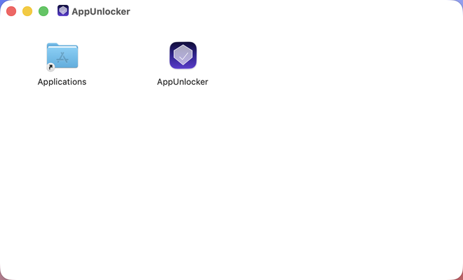

<p align="center">
  
</p>

<p align="center">
  <a href="https://tsingke.github.io/AppUnlocker">🌐 Website</a> ·
  <a href="README.zh.md">🇨🇳 中文</a>
</p>

<br>

<p align="center">
  
</p>

<h1 align="center">
  AppUnlocker
</h1>

<p align="center">
  <b>Remove macOS quarantine attributes with ease</b>
</p>

<p align="center">
  
  
  
  
  <a href="https://tsingke.github.io/AppUnlocker"></a>
</p>

<br>

## 📖 Overview

Ever downloaded an app on your Mac only to see this?

> **""Example.app" is damaged and can't be opened. You should move it to the Trash."**

This is macOS **Gatekeeper** in action. When you download an app from the internet, the system stamps it with the `com.apple.quarantine` extended attribute. Gatekeeper reads this flag and blocks the app from launching.

**AppUnlocker** is a native macOS utility that strips the quarantine attribute so your app runs normally again — no terminal, no commands, no hassle.

<br>

## ✨ Features

| Feature | Description |
|---------|-------------|
| 🖱️ **Drag & Drop** | Drop any `.app` bundle onto the drop zone to begin |
| 📁 **File Picker** | Browse and select apps via native `NSOpenPanel` |
| ⚡ **Two‑Step Unlock** | Attempts direct `xattr` removal first; escalates to admin if needed |
| 📋 **Fix History** | View previously fixed apps with status and timestamps |
| 🔁 **Retry & Open** | Re‑attempt a failed fix or launch a successfully unlocked app |
| 🧹 **Clean Up** | Remove individual records or clear the entire history |
| 🎨 **Native UI** | Built with SwiftUI & AppKit — feels right at home on Mac |
| 🔒 **Privacy First** | Fully offline. No data collected. Everything stays on your machine. |

<br>

## 🖼️ Screenshots

<p align="center">
  
  &nbsp;&nbsp;
  
</p>

<br>

## 📦 Installation

### Option 1: Download DMG (recommended)

Download the latest `AppUnlocker.dmg` from the [Releases page](https://github.com/tsingke/AppUnlocker/releases), open it, and drag the app into your **Applications** folder.

Or download directly:

[⬇️ Download AppUnlocker.dmg](https://github.com/tsingke/AppUnlocker/releases/download/v1.0.0/AppUnlocker.dmg)

> **Note:** The app is ad-hoc signed (no paid Apple Developer ID). The first launch will trigger a Gatekeeper warning. **Right-click → Open** to bypass it. This is a one-time step.

### Option 2: Build from source

```bash
# Clone the repository
git clone https://github.com/tsingke/AppUnlocker.git
cd AppUnlocker

# Open in Xcode
open AppUnlocker.xcodeproj

# Select scheme: AppUnlocker > My Mac
# Press ⌘R to build & run
```

**Requirements:**
- macOS 13.0+
- Xcode 15+
- Swift 5.0

<br>

## 🔧 How It Works

### Technical Background

When macOS downloads an app, it adds an extended attribute:

```bash
$ xattr -l /Applications/Example.app
com.apple.quarantine: 0081;674e3c2c;Google Chrome;...
```

Gatekeeper detects this attribute and blocks the app from running.

### Two-Step Removal Strategy

**Step 1 — Direct**
Attempts the `xattr` command under the current user's privileges. Succeeds when the user owns the app.

```bash
xattr -r -d com.apple.quarantine /Applications/Example.app
```

**Step 2 — Elevated**
If Step 1 fails (e.g., the app belongs to system), AppUnlocker presents a standard macOS authorization dialog via AppleScript, requesting admin credentials to run the same command.

```bash
osascript -e 'do shell script "xattr -r -d com.apple.quarantine /Applications/Example.app" with administrator privileges'
```

Both operations run in a background thread (`Task.detached`) so the UI stays fully responsive.

<br>

## 🏗️ Architecture

```
AppUnlocker/
├── AppUnlockerApp.swift          # @main app entry point
├── ContentView.swift             # Root view (title bar, drop zone, history)
├── AppUnlockerViewModel.swift    # Business logic + @MainActor state management
├── AppItem.swift                 # Data model (AppItem + FixStatus)
├── DropZoneView.swift            # Drag‑and‑drop interface
├── HistoryRowView.swift          # History card with animated status
├── Assets.xcassets/              # App icon + accent color
│   └── AppIcon.appiconset/       # 10 PNG sizes (16×16 → 1024×1024)
├── Info.plist                    # Bundle metadata
└── AppUnlocker.entitlements      # Entitlements (sandbox disabled)
```

**Pattern:** MVVM (Model-View-ViewModel)
**Stack:** SwiftUI + AppKit

<br>

## 🌐 Website

Visit [tsingke.github.io/AppUnlocker](https://tsingke.github.io/AppUnlocker) for the full landing page with screenshots, download links, and detailed documentation.

<br>

## 📄 License

This project is open source under the [MIT License](LICENSE).

---

<p align="center">
  Made with ❤️ for the macOS open‑source community
</p>
