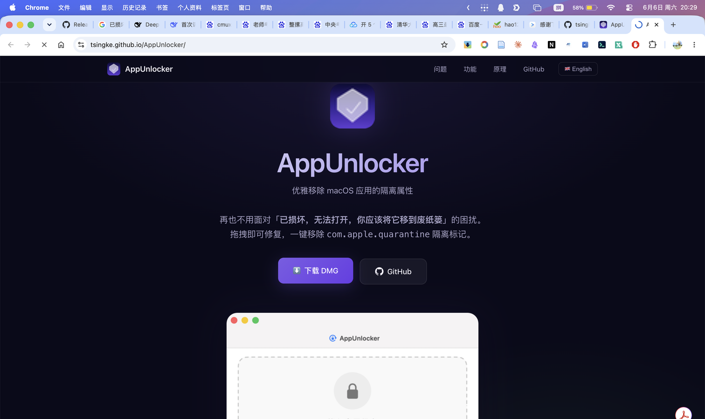
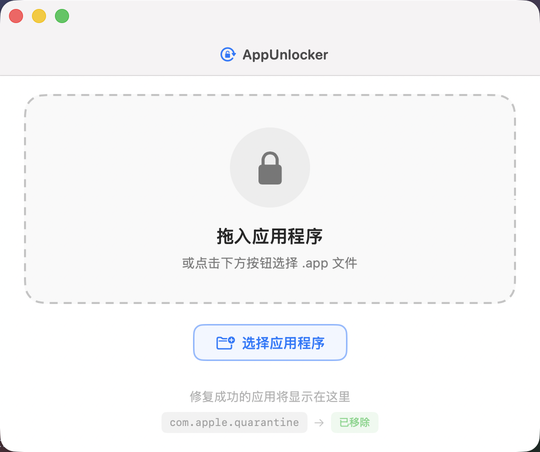

  

 

  
  
  
  
  

 

<h1 align="center">
  AppUnlocker
</h1>

  <b>Remove macOS quarantine attributes with ease</b> 
  <b>优雅移除 macOS 应用的隔离属性</b>

 

  
  &nbsp;&nbsp;
  

 

---

  

  Screenshot / 截图预览

 

## 🚀 Quick Links / 快速导航

| | |
|---|---|
| 🇬🇧 **English** | [README.en.md](README.en.md) — full documentation in English |
| 🇨🇳 **中文** | [README.zh.md](README.zh.md) — 完整中文文档 |
| 🌐 **Website** | [tsingke.github.io/AppUnlocker](https://tsingke.github.io/AppUnlocker) |
| 📥 **Download** | [AppUnlocker.dmg](https://github.com/tsingke/AppUnlocker/releases/download/v1.0.0/AppUnlocker.dmg) |

 

## ✨ Highlights / 亮点

**🇬🇧** AppUnlocker removes the `com.apple.quarantine` extended attribute from downloaded macOS apps, fixing the *"is damaged and can't be opened"* error. Drag & drop any .app to instantly strip the quarantine flag — no terminal needed.

**🇨🇳** AppUnlocker 可移除 macOS 下载应用的 `com.apple.quarantine` 隔离属性，解决「已损坏，无法打开」的错误提示。拖拽即可修复，无需终端命令。

 

## 📜 License / 许可

[MIT](LICENSE) © AppUnlocker

---

  Made with ❤️ for the macOS community

